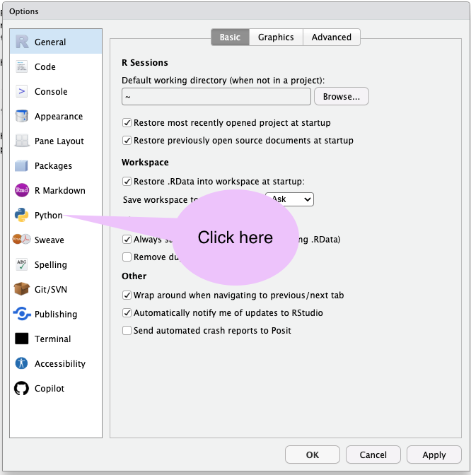
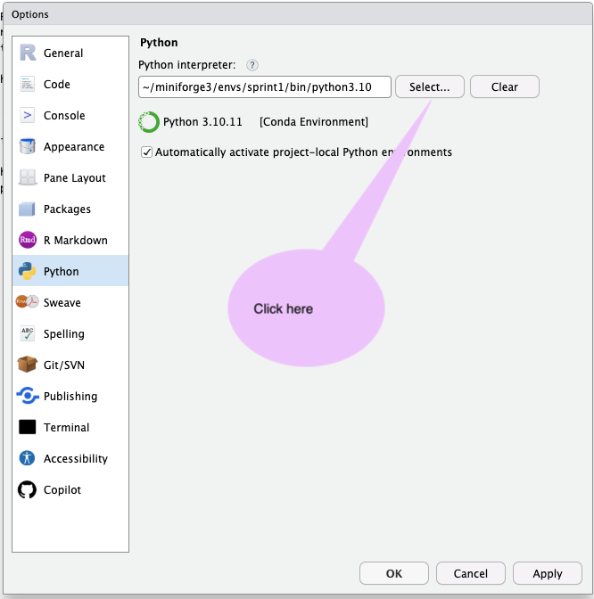
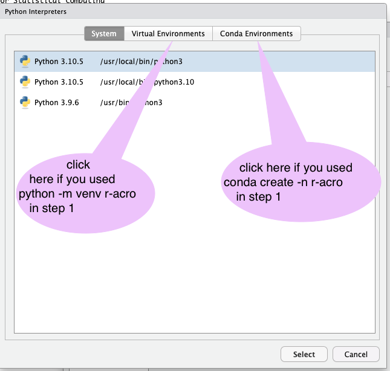
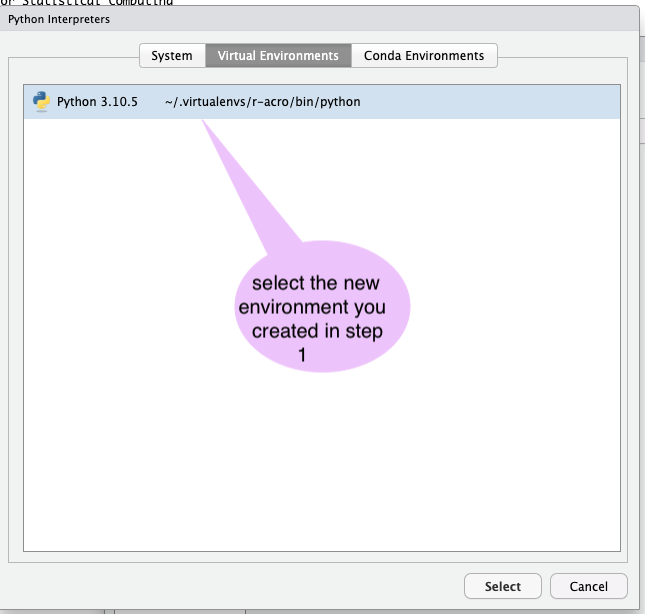

# Installation Guides

This document is intended to provide help installing and running acro-r in different settings.

Keeping this comprehensive will require input from the community.

So please email sacro.contact@uwe.ac.uk, or [raise an issue on the GitHub repository](https://github.com/AI-SDC/ACRO-R/issues/new/choose) if:
 - you have a setting that is not covered, or
 - the steps outlined below do not work for you,

**Please note**: most of the scenarios below assume that
- you have a working version of Python 3 (version 3.9 or higher) on your system
- you are able to access a terminal or command prompt to write and execute some commands.

---

## Step 1 create a python virtual environment and install the base python package *acro*
**In every case** we recommend that you create what is called a 'python virtual environment' called **r-acro**.
Virtual environments (*venv's*) are recommended best practice.
This is because they isolate the impact of any changes you make in one venv - such as adding or updating a package- from the rest of your system.

There are many tutorials available on the web if you get stuck.
We do not endorse any particular site, but here are some examples:
- [an overview with examples  for windows/linux/mac](https://python.land/virtual-environments/virtualenv)
- [another that also contains instructions for VSCode and Pycharm](https://realpython.com/python-virtual-environments-a-primer/)

**For individual users** we suggest that you do this in your home directory where you should have write permission.

**To install site-wide** we assume you have access rights and know where your organisation's preferred locations are (for example, this might be ```/usr/local``` on a linux system).

### Make a dedicated virtual environment
You can make a new virtual environment  via:
- the Anaconda GUI interface to the conda system
- command line access - by opening a terminal or command prompt and entering the command:
 ```sh
  conda create --n r-acro
  ```
if you have a version of conda installed or
 ```sh
python -m venv ./r-acro
```
to use the native python *venv* package.

### Change to that virtual environment and install acro
Anaconda comes with its own GUI to makes this process easy.

**On any system** using *conda* from the command line :
```sh
conda activate r-acro
conda install conda-forge::acro

#assuming this completes successfuly you can now exit
conda deactivate r-acro
```

**On Windows**from the command line with python's *pip* package manager:
```sh
# In cmd.exe
r-acro\Scripts\activate.bat
# In PowerShell
r-acro\Scripts\Activate.ps1
```
followed by
```sh
python -m pip install acro
#assuming this completes successfuly you can now exit the virtual environment
deactivate
```

**On linux/mac** using conda:

```sh
source r-acro/bin/activate
#you should see the your command prompt change to show (r-acro)
python -m pip install acro
#assuming this completes successfuly you can now exit the virtual environment
deactivate
```
---

## Step 2 Install the R packages *reticulate* and *acro*

The *reticulate* package is the industry-standard method for supporting communications between R and Python.
It provides the `plumbing` between the R `front-end'

These commands should work whether you are
- working on a machine outside the TRE: in which case packages should install from a mirror of the CRAN service
- working on a machine inside a TRE: in which case the administrator should have set up a local mirror of approved packages from CRAN

**For individual users** without permission to make site-wide or machine-wide changes
Open your preferred R interface - for  example, RStudio, and in a R window type
```R
install.packages*("reticulate")
install.packages("acro")
```

**For adminstrators wishing to install for all users site-wide** the commands are  the same but you will need to run them in *sudo* mode.

---

## Step 3: Telling R and reticulate to use the new python virtual environment
The final step of the process is to tell the R package reticulate which version of python to use.

What we need to do is to set the value of a global variable ```RETICULATE_PYTHON```
The [R documentation for doing this](https://rstudio.github.io/reticulate/articles/versions.html) is a little inconsistent here, but the following  options all seem to work.

### Option 1- For individuals using RStudio
If you follow the menu items from ```Tools->Project Options ->Python``` or ```Tools->Global Options->Python``` you can tell it to use the version of python from the virtual environment you create in step 1, either for a specifc R project or for all your sessions as shown below









### Option 2 - Adding code to an individual project file
    you add add one of the following lines at the start of your file
   ```R
   #Either
    use_python("~/r-acro/bin/python")
   #or
   use_virtualenv("~/r-acro")
   #or
   use_condaenv("r-acro")
   #finally followed by
  library(reticulate)
  library("acro)"
   ```

### Option 3 - Editing your personal R preferences
In your home directory create (or edit) the file ```.Rprofile``` file, adding the lines

```R
Sys.setenv(RETICULATE_PYTHON=file.path(Sys.getenv("USERPROFILE"),"r-acro/bin/python"))
Sys.setenv(RETICULATE_PYTHON_ENV=file.path(Sys.getenv("USERPROFILE"),"r-acro"))
```


### Option 4- Making site-wide changes
 You can also edit the [site-wide Rprofile]() file to add these global environment variables, using replacing *~/r-acro* with the path to wherever you created the dedicated virtual environment.
